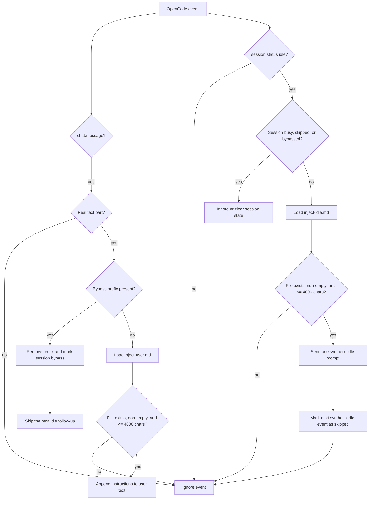

# OpenCode Context Injector

Project-file based context injection for OpenCode.

## Features

- Appends `.opencode/inject-user.md` to normal user prompts.
- Runs `.opencode/inject-idle.md` once after a session becomes idle.
- Replaces `{{CURRENT_DATE}}` when an instruction file is read.
- Ignores synthetic idle messages to prevent cross-injection.
- `? ` at the beginning bypasses both injection chains and is removed before
  the prompt reaches the model.
- Empty or missing project files disable the corresponding behavior.
- The Markdown files are user-editable prompt instructions, not hard-coded
  policy. Users can replace, customize, or empty them for each project.
- Installs the `/setup-inject-context` project command for generating the two
  files from verified project information.
- Instruction files are limited to 4000 characters.

## Technical Flow

The plugin registers two OpenCode hooks. It checks the worktree and project
directory in that order and uses the first valid instruction file it finds.
Files are read when the matching hook runs, so date placeholders and file
changes use the current content.



### User Messages

For a normal message, the plugin finds the first non-synthetic text part and
appends the expanded contents of `inject-user.md`. If no valid file is found,
the message remains unchanged. The `? ` prefix removes itself from the
message and prevents the idle follow-up for that session cycle.

### Idle Follow-up

When a session becomes idle, the plugin loads `inject-idle.md` and sends it as
one synthetic prompt. Session state prevents parallel follow-ups and skips the
idle event generated by that synthetic prompt. A failed prompt clears the
state so a later idle event can retry.

### Configuration Boundary

The Markdown files define the prompt content and are fully user-editable. The
plugin controls only lookup, date expansion, length checks, bypass handling,
synthetic-message filtering, and idle state management.

## Install From GitHub

Clone the repository and run the installer for a project:

```bash
git clone https://github.com/nobiehl/opencode-context-injector.git
cd opencode-context-injector
./install.sh /path/to/project
```

The installer copies the plugin to
`~/.config/opencode/plugins/opencode-context-injector.js` and creates the two
project templates and the `.opencode/commands/setup-inject-context.md` command
only when they do not already exist. Existing project files are preserved.

Run `/setup-inject-context` in the installed project to scan relevant project
files and create missing injection files. Add `--force` to the command
arguments only when existing injection files should be replaced.

Do not run the combined plugin together with separate `inject-user.js` or
`inject-idle.js` plugins. Disable those older plugins first to avoid duplicate
injections. The installer warns if it finds either legacy filename.

Restart OpenCode after installing or changing the plugin. Changes to the two
project Markdown files are loaded on the next matching event.

## Windows Installation

Run PowerShell from the cloned repository:

```powershell
Set-ExecutionPolicy -Scope Process Bypass
.\install.ps1 -ProjectPath C:\path\to\project
```

The installer uses `OPENCODE_CONFIG_DIR` when set. Otherwise it installs the
plugin under `%USERPROFILE%\.config\opencode\plugins`, which is OpenCode's
default configuration path on Windows.

## Local Development

OpenCode can also load `index.js` directly from a local plugin directory. The
package has no runtime dependencies.

## CI Testing Plan

The planned cross-platform CI design is documented in
[`docs/ci-testing-plan.md`](docs/ci-testing-plan.md). It covers Linux and
Windows installers, isolated OpenCode smoke checks, local plugin behavior
tests, and separately protected live provider checks.

## Context Budget

Generated instruction files target no more than approximately 500 tokens for
`inject-user.md` and 700 tokens for `inject-idle.md`. Exact counts depend on
the model tokenizer.

The compact instruction rules and their maintenance limits are documented in
[`docs/context-budget.md`](docs/context-budget.md).

## Future Work

- Publish `opencode-context-injector` to npm.
- Support the official `opencode plugin <module>` installation path.
- Document registration through the OpenCode `plugin` configuration.
- Keep the installer as a bootstrap for project instruction files, because
  OpenCode installs plugins but does not create these project templates.
- Add CI coverage for npm installation and official plugin loading.

## License

MIT
